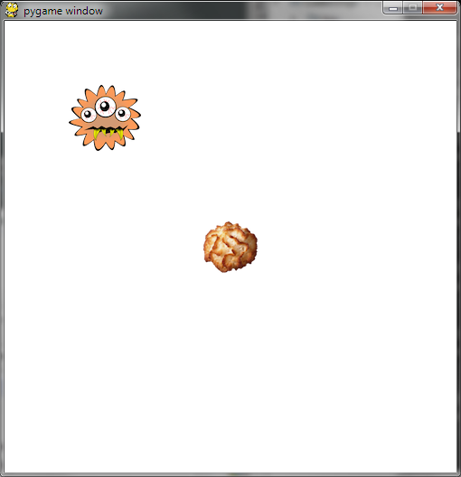

.. include:: /global.rst

Koekjesmonster |level1|
=======================

Bron: `coderdojo-gent-pygame`_ van Yannick Clybouw

.. _coderdojo-gent-pygame: https://bitbucket.org/yclybouw/coderdojo-gent-pygame

Doel
----

Programmeer het koekjesmonster zó dat ze haar weg vindt naar de koekje(s)
en deze kan opeten!

Wat heb je nodig?
-----------------

* Een werkende Python-installatie (inclusief pygame)
  (zie :doc:`/start/installatie`)
* De Python code voor deze oefening: `download`_ deze bestanden en plaats
  deze op je computer in dezelfde map waar je ook je oplossing zal aanmaken
  en bewaren

.. _Download: https://bitbucket.org/yclybouw/coderdojo-gent-pygame/downloads/

Oefening 1A
-----------

Er verschijnt een monster en één koekje.
Vul de programmalus in zó dat het monster op weg gaat naar het koekje
om het op te eten.

.. code-block:: python

   from oefening_01 import OpdrachtA

   opdracht = OpdrachtA(500, 500)
   monster = opdracht.monster
   koekje = opdracht.koekje

   def programmalus():
       """Beweeg het monster naar het koekje."""
       # ---------------------------------------------- #
       #                                                #
       #   Vul hier je programmalus in!                 #
       #                                                #
       # -----------------------------------------------#

   opdracht.start(programmalus)

De positie op het scherm van het koekje is:

   (`koekje.x`, `koekje.y`)

De positie op het scherm van het monster is:

   (`monster.x`, `monster.y`)

Hierbij komt (`0`, `0`) overeen met links-boven op het scherm.

Je kan het monster bewegen met de volgende acties:

* ga één stap naar links:  `monster.stap_links()`
* ga één stap naar rechts: `monster.stap_rechts()`
* ga één stap naar omhoog: `monster.stap_omhoog()`
* ga één stap naar omlaag: `monster.stap_omlaag()`

.. admonition:: Scratch vs. Python
   :class: tip

   +---------------------+------------+
   | Scratch             | Python     |
   +=====================+============+
   | als ... dan         | if ... :   |
   +---------------------+------------+
   | anders              | else:      |
   +---------------------+------------+
   | anders, als ... dan | if ... :   |
   |                     | elif ...:  |
   |                     | else ...:  |
   +---------------------+------------+

Oefening 1B
-----------

Er verschijnt een monster en een koekje.
Elke keer als je het spelletje start,
zal het koekje op een *willekeurige* plaats verschijnen.

Vul de programmalus in zó dat het monster op weg gaat naar het koekje
om het op te eten.

.. code-block:: python

   from oefening_01 import OpdrachtA

   opdracht = OpdrachtB(500, 500)
   monster = opdracht.monster
   koekje = opdracht.koekje

   def programmalus():
       """Beweeg het monster naar het koekje."""
       # ---------------------------------------------- #
       #                                                #
       #   Vul hier je programmalus in!                 #
       #                                                #
       # -----------------------------------------------#

   opdracht.start(programmalus)

Oefening 1C
-----------

Er verschijnt een monster,
samen met *verschillende* koekjes op *willekeurige* plaatsen.

Vul de programmalus in zó dat het monster één voor één op weg gaat
naar de koekjes om ze op te eten.

.. code-block:: python

   from oefening_01 import OpdrachtC

   opdracht = OpdrachtC(500, 500)
   monster = opdracht.monster
   koekjesgroep = opdracht.koekjesgroep
   # De koekjesgroep heeft verschillende sprites.
   # Telkens je een koekje opeet, verdwijnt die uit de groep.

   def programmalus():
       """Beweeg het monster naar de koekjes, één voor één."""
       # ---------------------------------------------- #
       #                                                #
       #   Vul hier je programmalus in!                 #
       #                                                #
       # -----------------------------------------------#
       yield

   opdracht.start(programmalus)

Alle koekjes zitten in `koekjesgroep`. Je kan alle koekjes overlopen
met een lus.

Telkens het monster een koekje opeet, verdwijnt het koekje uit de
groep. Je kan testen of een koekje nog in de groep zit met:

.. code-block:: python

   koekje in koekjesgroep

Merk op: je dient ``yield`` te gebruiken binnen in je lus.

.. admonition:: Scratch vs. Python
   :class: tip

   +-------------------------------------+-------------------+
   | Scratch                             | Python            |
   +=====================================+===================+
   | herhaal (voor elke X uit de GROEP)  | for X in GROEP    |
   +-------------------------------------+-------------------+
   | omgekeerde van "herhaal tot"        | while VOORWAARDE  |
   +-------------------------------------+-------------------+

.. admonition:: Lussen in Python
   :class: tip

   | ``break`` = verlaat de lus
   | ``continue`` = sla alles over tot de volgende herhaling van de lus

Oefening 1C extra
-----------------

Als oefening 1C gelukt is, kun je als extra uitdaging ervoor zorgen dat
het monster telkens het dichtste koekje opeet voordat ze naar het volgende
koekje gaat.

De afstand tussen het monster en een koekje kan je berekenen met het
volgende stukje code:

.. code-block:: python

   import math

   def afstand(monster, koekje):
       return math.sqrt((monster.x - koekje.x) ** 2 +
                        (monster.y - koekje.y) ** 2)

Oefening:

.. code-block:: python

   import math

   from oefening_01 import OpdrachtC

   opdracht = OpdrachtC(500, 500)
   monster = opdracht.monster
   koekjesgroep = opdracht.koekjesgroep

   def afstand(monster, koekje):
       return math.sqrt((monster.x - koekje.x) ** 2 +
                        (monster.y - koekje.y) ** 2)

   def programmalus():
       """Beweeg het monster naar de koekjes,
       te beginnen met het dichtsbijzijnde koekje."""
       # ---------------------------------------------- #
       #                                                #
       #   Vul hier je programmalus in!                 #
       #                                                #
       # -----------------------------------------------#
       yield

   opdracht.start(programmalus)

