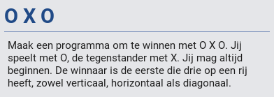

.. include:: /global.rst

O x O
=====

:Niveau: |level2|
:Bron: `pythoncourse`_ van Yannick Clybouw

.. _pythoncourse: https://bitbucket.org/lostunicorn/pythoncourse

Wat heb je nodig?
-----------------

* Een werkende Python-installatie (inclusief pygame)
  (zie :doc:`/start/installatie`)
* Kivy (zie :doc:`/start/installatie`)
* De Python code voor deze oefening: `download`_ deze bestanden en plaats
  deze op je computer in een map naar keuze

.. _download: https://bitbucket.org/lostunicorn/pythoncourse/downloads/

Doel
----

Wat zal je leren?
-----------------

* geneste lijsten
* spellogica

Oefening
--------

Ga naar de map waar je de oefenbestanden bewaarde, en start de oefening met:

.. code-block:: doscon

   (venv37) CoderDojo> python main.py 7

Oplossing
---------

`Voorbeeldoplossingen pythoncourse`_

.. _Voorbeeldoplossingen pythoncourse: https://docs.google.com/document/d/1IZ4apewmri7Z8S1CMQw-KSe26YP-mfvG2dGJ2weDOjE

