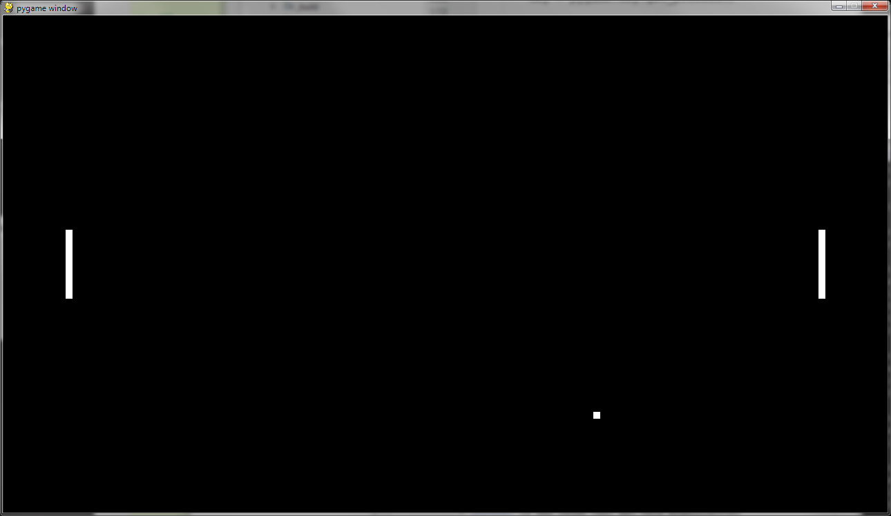

.. include:: /global.rst

Pong
====

:Niveau: |level2|
:Bron: Raf Schoenmaekers

Doel
----

Pong in Python.

Pong is ...

Wat zal je leren?
-----------------

...

Wat heb je nodig?
-----------------

* Een werkende Python-installatie (inclusief pygame)
  (zie :doc:`/start/installatie`)
* Basiskennis Python (zie :ref:`starten-met-python`)
* Basiskennis pygame (zie :doc:`/projecten/snake`)

Aan de slag
-----------

Stappen: ...

Mogelijke oplossing
-------------------

.. code-block:: python

   import sys
   import pygame

   size = width, height = 1280, 720

   black = (0, 0, 0)
   white = (255, 255, 255)

   ballSpeed = [2, 2]
   ballRect = pygame.Rect(width / 2, height / 2, 10, 10)

   racketOffset = 100
   racketHeight = 100
   racketWidth = 10

   player1Rect = pygame.Rect(racketOffset - racketWidth,
                             (height - racketHeight) / 2,
                             racketWidth,
                             racketHeight)
   player2Rect = pygame.Rect(width - racketOffset,
                             (height - racketHeight) / 2,
                             racketWidth,
                             racketHeight)

   player1Speed = player2Speed = 0.0
   playerAcceleration = 1.0
   player1Score = player2Score = 0

   # start game
   pygame.init()
   screen = pygame.display.set_mode(size)

   while True:
       for event in pygame.event.get():
           if event.type == pygame.QUIT:
               sys.exit()

       # move ball
       ballRect = ballRect.move(*ballSpeed)

       if ballRect.left < 0 or ballRect.right > width:
           if ballRect.left < 0:
               player2Score += 1
           else:
               player1Score += 1
           print(f' SCORE {player1Score} - {player2Score}')
           # reset ball to center of screen
           ballRect.x = width / 2
           ballRect.y = height / 2

       if ballRect.top < 0 or ballRect.bottom > height:
           ballSpeed[1] = -ballSpeed[1]

       # move players
       player1Speed *= 0.9
       player2Speed *= 0.9

       key = pygame.key.get_pressed()

       if key[pygame.K_x]:
           player1Speed += playerAcceleration
       if key[pygame.K_s]:
           player1Speed -= playerAcceleration
       if key[pygame.K_UP]:
           player2Speed -= playerAcceleration
       if key[pygame.K_DOWN]:
           player2Speed += playerAcceleration

       player1Rect.y += player1Speed
       player2Rect.y += player2Speed

       if ballRect.colliderect(player1Rect):
           ballSpeed[0] = abs(ballSpeed[0])
       if ballRect.colliderect(player2Rect):
           ballSpeed[0] = -abs(ballSpeed[0])

       # start drawing
       screen.fill(black)
       pygame.draw.rect(screen, white, ballRect)
       pygame.draw.rect(screen, white, player1Rect)
       pygame.draw.rect(screen, white, player2Rect)

       # wait
       pygame.display.update()
       pygame.time.delay(10)
