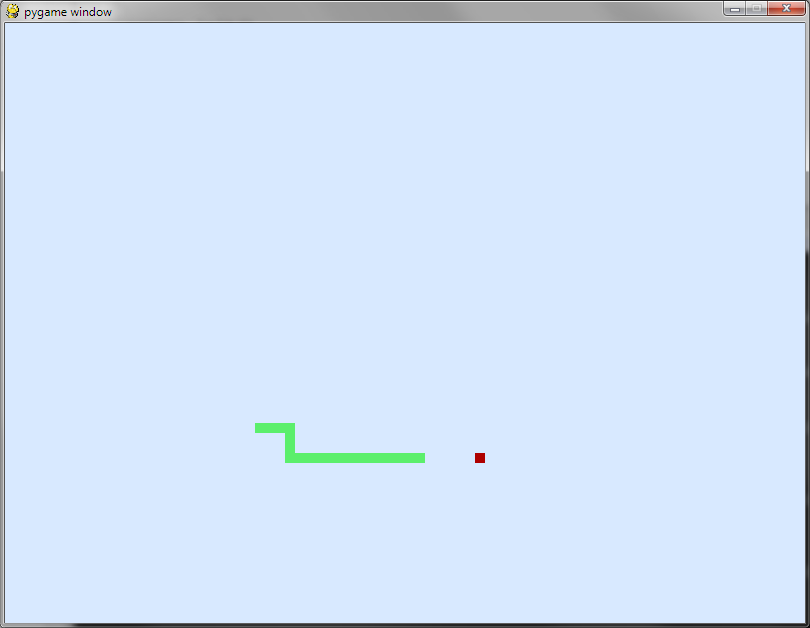

.. include:: /global.rst

Spelletjes maken in pygame: Snake |level3|
==========================================

Bron: Aagje Reynders

Doel
----

Snake in Python.

Snake is een spelletje waar een slang moet proberen appels te eten.
Deze appels komen willekeurig op het scherm.
Met de pijltjestoetsen probeer je met de slang naar de appel te kruipen
zonder tegen de randen of jezelf te botsen.
Elke keer dat je een appel eet wordt je slang langer.

Wat zal je leren?
-----------------

* pygame concepten: *events*, werken met kleuren, tekenen op het scherm, ...
* spellogica

Wat heb je nodig?
-----------------

* Een werkende Python-installatie (inclusief pygame)
  (zie :doc:`/start/installatie`)
* Basiskennis Python (zie :ref:`starten-met-python` en :ref:`oefeningen`)

Stappen
-------

Volg de stappen zoals beschreven in `Games ontwikkelen [pygame cursus.pdf]`_
(door Aagje Reynders).

.. _Games ontwikkelen [pygame cursus.pdf]: https://drive.google.com/file/d/0B-uRP0UyuNK4VlpKLVhsQVpuWUU

Overzicht stappen:
   1. Werken met events
   2. Tekenen op het scherm: slang = rechthoek
   3. Bewegen van slang (rechthoek)
   4. Randen herkennen
   5. Plaats appel(s)
   6. Laat slang langer worden

Mogelijke oplossing
-------------------

.. code-block:: python

   import pygame
   import random

   pygame.init()

   gameDisplay = pygame.display.set_mode((800, 600))

   FRAME_RATE = 15  # FPS

   clock = pygame.time.Clock()
   font = pygame.font.SysFont(None, 25)
   groen = (91, 239, 108)
   rood = (174, 0, 0)
   achtergrondkleur = (216, 233, 255)

   def toon_bericht(bericht, kleur=(51, 40, 255)):
       tekst = font.render(bericht, True, kleur)
       tekst_rect = tekst.get_rect()
       tekst_rect.center = (400, 300)
       gameDisplay.blit(tekst, tekst_rect)
       pygame.display.update()

   def teken_slang(slang_lichaam):
       for x, y in slang_lichaam:
           pygame.draw.rect(gameDisplay, groen, [x, y, 10, 10])

   x = 400
   y = 300
   slang_lengte = 1
   slang_lichaam = []
   richting = 'RECHTS'
   game_exit = False
   game_over = False
   game_pauzed = False

   rand = 5
   appel_x = random.randint(0 + rand, 79 - rand) * 10
   appel_y = random.randint(0 + rand, 59 - rand) * 10

   while not game_exit:
       for event in pygame.event.get():
           if event.type == pygame.QUIT:
               game_over = True
           elif event.type == pygame.KEYDOWN:
               if event.key == pygame.K_LEFT and richting != 'RECHTS':
                   richting = 'LINKS'
               elif event.key == pygame.K_RIGHT and richting != 'LINKS':
                   richting = 'RECHTS'
               elif event.key == pygame.K_UP and richting != 'ONDER':
                   richting = 'BOVEN'
               elif event.key == pygame.K_DOWN and richting != 'BOVEN':
                   richting = 'ONDER'
               elif event.key == pygame.K_q:
                   game_exit = True
               elif event.key == pygame.K_SPACE:
                   game_pauzed = not game_pauzed
                   if game_pauzed:
                       toon_bericht("PAUZE")

       if game_pauzed:
           continue

       if richting == 'LINKS':
           x -= 10
       elif richting == 'RECHTS':
           x += 10
       elif richting == 'BOVEN':
           y -= 10
       elif richting == 'ONDER':
           y += 10

       slang_hoofd = (x, y)
       slang_lichaam.append(slang_hoofd)
       if len(slang_lichaam) > slang_lengte:
           del slang_lichaam[0]

       if (not 0 < x < 800) or (not 0 < y < 600):
           game_over = True

       if slang_hoofd in slang_lichaam[:-1]:
           game_over = True

       if x == appel_x and y == appel_y:
           appel_x = random.randint(0 + rand, 79 - rand) * 10
           appel_y = random.randint(0 + rand, 59 - rand) * 10
           slang_lengte += 1

       gameDisplay.fill(achtergrondkleur)
       pygame.draw.rect(gameDisplay, rood, [appel_x, appel_y, 10, 10])
       teken_slang(slang_lichaam)
       pygame.display.update()

       clock.tick(FRAME_RATE)

       if game_over:
           toon_bericht("GAME OVER! Druk 'r' op opnieuw te proberen, "
                        "'c' om verder te gaan, of 'q' om af te sluiten")
       while game_over:
           for event in pygame.event.get():
               if event.type == pygame.KEYDOWN:
                   if event.key == pygame.K_q:  # 'a' op AZERTY toetsenbord...
                       game_exit = True
                       game_over = False
                   elif event.key == pygame.K_c:  # continue
                       game_over = False
                       x = 400
                       y = 300
                   elif event.key == pygame.K_r:  # restart
                       game_over = False
                       x = 400
                       y = 300
                       slang_lengte = 1
                       slang_lichaam = []

   pygame.quit()

