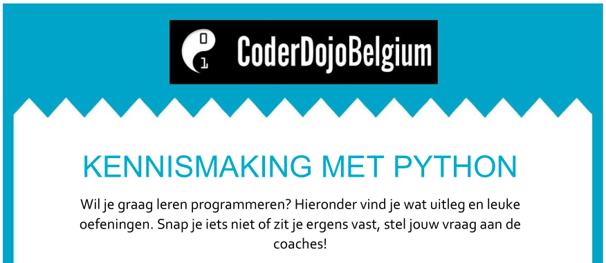

.. include:: /global.rst

Kennismaking met Python
=======================

:Niveau: |level1|
:Bron: Aagje Reynders

Wat zal je leren?
-----------------

* :code:`print`
* Gebruik van variabelen
* :code:`input` om tekst in te lezen
* :code:`if/elif/else`
* :code:`for`
* Gebruik van lijsten
* :code:`def`
* :code:`random`

Wat heb je nodig?
-----------------

* Een werkende Python-installatie (zie :doc:`installatie`)
* Interactieve Python-prompt, bij voorkeur IPython (zie :doc:`installatie`)
* Een Python-editor, bv. IDLE.
  IDLE kan je openen vanuit het Start-menu: "IDLE (Python 3.7 64 bit)".
  Dit toont de "Python 3.7.0 Shell". De editor open je door een nieuw
  bestand aan te maken via :menuselection:`File --> New File`.

Aan de slag
-----------

Zie `Kennismaking met Python [Kennismaking met Python.pdf]`_
(Aagje Reynders).

Inhoudstafel:

1. Toon tekst op het scherm m.b.v. :code:`print`
2. Toon je naam op het scherm waarbij je een variabel gebruikt
3. Vraag leeftijd van gebruiker m.b.v. :code:`input`
4. Vergelijk twee getallen en toon welke het grootste is
5. Tel van 1 t.e.m. 100
6. Beheer lijst van deelnemers
7. Teken ovalen op het scherm

.. _Kennismaking met Python [Kennismaking met Python.pdf]: https://drive.google.com/file/d/1s12L4sIU-WU-DM0DNQ_s6aBhFoMWQjMD

Extra
-----

1. Gebruik willekeurige kleur voor ovalen
2. Maak een gokspelletje waarbij je een willekeurig getal probeert te raden
3. Maak een rekenmachientje voor twee getallen

