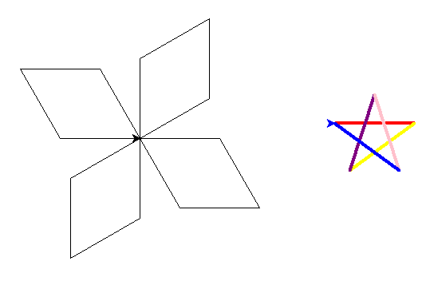
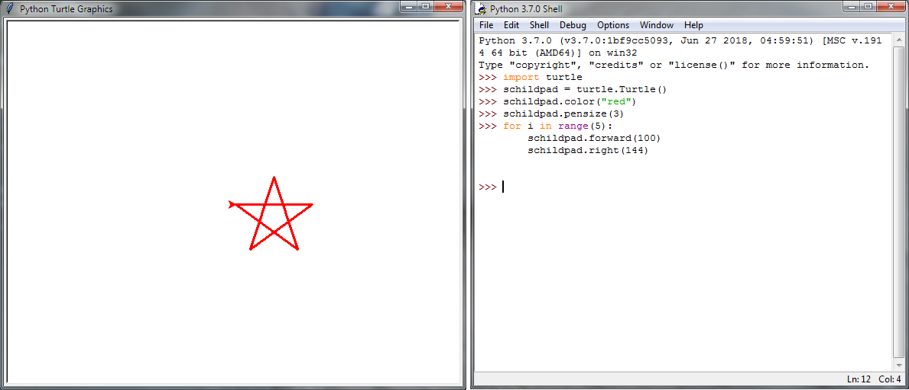

.. include:: /global.rst

Schildpad
=========

:Niveau: |level1|
:Bronnen: `Codingkids`_, Johan Vereecken

Doel
----

Maken van diverse figuren in Python
door het bewegen van de Python schildpad (*Turtle*) over het scherm.

Wat heb je nodig?
-----------------

* Een werkende Python-installatie (zie :doc:`/start/installatie`)
* Een Python-editor. In deze opdrachten gebruiken we `IDLE`_.
  IDLE kan je openen vanuit het Start-menu: "IDLE (Python 3.7 64 bit)".
  Dit toont de "Python 3.7.0 Shell". De editor open je door een nieuw
  bestand aan te maken via :menuselection:`File --> New File` (zie verder).

.. _IDLE: https://docs.python.org/3/library/idle.html

Wat zal je leren?
-----------------

* Gebruik van de Python-omgeving IDLE
* Gebruik van variabelen
* :code:`for`, :code:`while`
* Mogelijke opdrachten (*commands*) voor de schildpad
* Verband tussen Scratch en Python

Aan de slag
-----------

Zie `Programmeren met Python`_ op `Codingkids`_.

.. _Programmeren met Python: https://codingkids.nl/python-lessen.html
.. _Codingkids: https://codingkids.nl/

Extra
-----

Zie `Python opdrachtjes [Python_beginner_opdrachtjes_Turtle.pdf]`_
(Johan Vereecken).

.. _Python opdrachtjes [Python_beginner_opdrachtjes_Turtle.pdf]: https://drive.google.com/file/d/0B1R4ph67gGq2MGlPX24wdmM0SGM

.. Overzicht:
   1. Vierkant tekenen
   2. Ster tekenen
   3. Parallellogram tekenen
   4. Stempelen
   5. While loop (vierkant, ster en cirkel)
   6. While lus pengrootte
   7. Olympische ringen
   8. Kleuren red, green, blue
   9. Random (willekeurig)
   10. Graphics voorbeelden

Nuttige links
-------------

* `Turtle graphics`_
* `Python Turtle Graphics, How to Think Like a Computer Scientist`_

.. _Turtle graphics: https://docs.python.org/3.7/library/turtle.html
.. _Python Turtle Graphics, How to Think Like a Computer Scientist: https://www.interactivepython.org/runestone/static/thinkcspy/PythonTurtle/toctree.html

.. Oplossingen
   -----------

.. vierkant.py
   ~~~~~~~~~~~

   .. code-block:: python

      import turtle

      elsa = turtle.Turtle()
      for i in range(4):
          elsa.forward(100)
          elsa.right(90)

